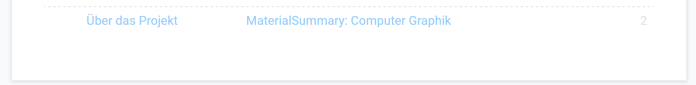

# Guidelines - v1.3.0

Diese Guidelines definieren Struktur, Inhalt & Styling einer Zusammenfassung.

# Inhalt

## Allgemeines

-   Deutsch als Standardsprache, Anglizismen erlaubt
-   Quelltexte ausschließlich auf Englisch
-   Struktur und Inhalt sollte sich weitestgehend nach Altklausuren richten (falls vorhanden) und alle anderen Zusammenfassungen vereinen (nicht zusammenkopieren, sondern logisch ersetzen!)
-   Informationen/Überschriften/etc. so komprimiert und logisch wie möglich
-   Bei Platzmangel: Inhalte mit den niedrigsten Bewertungseinheiten/cm zuerst streichen
-   Möglichst wenig erklärenden Fließtext, da dieser selten prüfungsrelevant ist. Der Sinn sollte anderweitig dargestellt werden (Tabellen, Formeln, Schritte, Hinweise)
-   Die Länge der Zusammenfassung sollte immer der Maximal-Länge für das aktuelle Semester entsprechen

## Mathematische Formeln

-   **Unformatierte mathematische Formeln sind verboten, keine Ausnahmen**
-   Formeln, bei denen für einen Abiturienten **möglicherweise** nicht auf Anhieb **alle** Zeichen erkennbar sind, müssen so kompakt wie möglich farbcodiert und erklärt werden (-> LaTeX)
-   Für Mathematische Formeln entweder den **Equation Editor** (built-in) oder LaTeX (z.B. [Overleaf](https://www.overleaf.com/read/vxcxbdmmtxyw)) verwenden
-   Für Schwarz-Weiß-LaTeX kann auch z.B. der **"Equation Editor ++" (Google Docs Addon)** verwendet werden
-   Einzelne Zeichen können per `Insert -> Special characters` eingefügt werden

Zum Bearbeiten von LaTeX mit vollem Funktionsumfang (z.B. Farb-Libraries) kann wie oben erwähnt Overleaf verwendet werden. Deren kostenlose Variante ist dabei völlig ausreichend.

[LINK ZU OVERLEAF](https://www.overleaf.com?r=9c649ec3&rm=d&rs=b)\*

**Disclaimer:** Der Link ist ein ref-link, ich würde mich also freuen, wenn ihr euren Account darüber anlegt.

**Die aktuellen Latex-Files sind (auch ohne Anmeldung) unter diesem Link erreichbar:** 
https://www.overleaf.com/read/vxcxbdmmtxyw

Dort seht ihr auch, wie man Farben benutzen kann.

# Styling

## Farbpalette

-   [Google Material Color Palette](https://www.materialui.co/colors) ("**Material**Summary")
-   Nur 500er Serie erlaubt (Ausnahmefälle möglich)
-   Schwarz = MaterialGrey900
-   Hintergrundfarbe: #ffffff

Für die Farbpalette gibt's unter Chrome eine geniale Extension namens [Simple Material Design Palette](https://chrome.google.com/webstore/detail/onaeadclbaeleijcfmmhopgmmmpedifa).

## Text-Styling

-   **Defaults:**
    -   **Font:** Roboto Normal
    -   **Farbe:** MaterialGrey900
    -   **Line Spacing:** 1
    -   **Custom Spacing:** 0
    -   **Custom Spacing (Überschriften 1-4):** 8 (before), 4 (after)
-   **Normaler Text:** 11, Line Spacing: 1.15
-   **Titel:** Roboto Light, 24, MaterialGrey700
-   **Überschrift 1:** 18
-   **Überschrift 2:** 16
-   **Überschrift 3:** 14
-   **Überschrift 4:** Roboto Bold, 12
-   **Links:** Normaler Text, MaterialBlue500, **nicht unterstrichen**
-   **Gleichungen per Equation Editor:** 12
-   **Code:** Roboto Mono, 11, MaterialGrey900
-   **LaTeX-Formeln:** Möglichst die gleiche Größe wie umliegendert Text. Falls unmöglich, gleiche Größe wie umliegende LaTeX-Formeln
-   **Sonstiges:**
    -   Überschriften dürfen nicht mit einem Doppelpunkt enden
    -   Kein fett markierter Text in Überschriften (Ausnahme: Überschrift 4)

## Tabellen

-   **Ränder:** MaterialGrey300, gestrichelte Rahmen, kein äußerer Rahmen
-   **Randdicke:** Ausschließlich 1px bzw. 1,5px (je nach Bedarf)
-   **Keine Hintergrundfarbe**
-   **Vertical Alignment:** middle
-   **Minimal-Abstand:** 0.1 falls nötig, sonst Standardabstand

## Code

-   Die Farbpalette gilt auch hier, Hintergrund ist #ffffff
-   Hier ist die [settings.json](settings.json) für Visual Studio Code
-   Code **muss** grundsätzlich autoformatiert sein, Formatierung kann zum Besseren Verständnis geändert werden
-   Für Kommentare im Code gilt inhaltlich das Gleiche wie hier

## Hinweise:

Hinweise müssen folgendermaßen formatiert werden (normaler Text):

> **Hinweis(e):** 
> Kurzer Satz oder Liste.

## Seitenlayout

-   **Deckblatt:**
    -   Titel
    -   Subtitle: Versionsnummer mit Verlinkung zur offiziellen Version
    -   Verlinkte Gliederung inkl. Seitennummern)
    -   Inhalt beginnt direkt unter der Gliederung
    -   Keine Seitennummer
-   **Rand:** 1cm, um Druckbarkeit zu gewährleisten
-   **Footer:**
    -   **Links:** "Über da Projekt" (Link zu diesem Repository)
    -   **Mitte:** MaterialSummary: [Fach] (Link zum offiziellen Google Doc der jeweiligen Zusammenfassung)
    -   **Rechts:** Seitennummer, beginnend bei 1 für's Deckblatt
        

## Sonstiges

-   **Punktuation:** Sätze enden mit Punkten, Tabellenzellen/Listen-Items nicht

## Versionsnummern

Versionsnummern werden für die Zusammenfassungen, die [GUIDELINES](GUIDELINES.md) & die [LIZENZ](LIZENZ.md) verwendet und müssen entsprechend aktualisiert werden.

**Schema:** 1.2.3

1: Es wurde inhaltlich etwas an der Gliederung geändert 
2: Es wurde inhaltlich etwas geändert 
3: Es wurde etwas verändert, aber nicht am Inhalt
