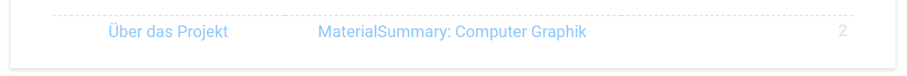

# Guidelines - v1.8.1

Diese Guidelines definieren Struktur, Inhalt & Styling einer Zusammenfassung.

# Inhalt

## Der Qualitätsanspruch

> Ein Student, der weder die Vorlesung noch die Übung besucht hat und dessen Mathe-Kenntnisse sich auf das Abitur beschränken, sollte mit einer Stunde Zeitaufwand zur Einarbeitung in die entsprechende Zusammenfassung die Prüfung bestehen.

**Aus diesem Qualitätsanspruch ergeben sich folgende Dinge:**

-   Das **einzige** Ziel der Zusammenfassung ist, die Prüfung zu bestehen. Das bedeutet, dass alle Inhalte, die nicht prüfungsrelevant sind sondern nur zum besseren Verständnis dienen, in der Zusammenfassung nichts zu suchen haben. Sie sorgen nur für Verwirrung und Zeitverlust in der Prüfung. Das Ziel ist nicht das Thema zu verstehen, sondern die Prüfung zu bestehen, das ist ein großer Unterschied
-   Eine Stunde ist wenig Zeit, muss aber ausreichen. Wenn man in der Vorbereitung lange braucht, um die Zusammenfassung zu verstehen, ist sie schlecht strukturiert und kostet in der Prüfung unnötig Zeit. Struktur und Inhalt müssen also so effizient wie möglich verpackt werden, sowohl was Platz als auch "Aufnahmegeschwindigkeit" angeht.

## Allgemeines

-   Inhaltlich sollte die Zusammenfassung alle anderen Zusammenfassungen logisch ersetzen. Dabei sollten die Themen nicht "zusammenkopiert" werden, sondern nur die relevanten Aspekte so knapp wie möglich eingearbeitet werden. Wenn am Ende ersichtlich ist, wo eine Information her ist, wurde ein Fehler begangen.
-   Altklausuren sollten den größten Einfluss auf den Inhalt haben, sofern davon auszugehen ist, dass die aktuelle Klausur ähnlich sein wird
-   Erklärender Fließtext ist selten prüfungsrelevant und der Sinn sollte anderweitig dargestellt werden (Tabellen, Formeln, Schritte, Hinweise)
-   Ein Beispiel mit Erklärungshinweisen ist fast immer besser als die Abstraktion

## Sprache

-   Deutsch als Standardsprache, Anglizismen erlaubt
-   Quelltexte ausschließlich auf Englisch

## Struktur

-   Der Leser muss den Weg von der Aufgabenstellung zur Lösung in der Zusammenfassung so schnell wie möglich finden
-   Überschriften sollten sich weitestgehend nach Altklausuren richten (falls vorhanden)
-   Die Länge der Zusammenfassung sollte immer der Maximal-Länge für das aktuelle Semester entsprechen

## Bei Platzmangel

-   Evaluieren, ob Querformat evtl. Platz spart
-   Unwichtige letzte Ebenen aus der Gliederung entfernen
-   Text-Styling auf kompakt umstellen
-   Footer kann weggelassen werden
-   Inhalte mit dem niedrigsten [EV](https://en.wikipedia.org/wiki/Expected_value)/cm zuerst streichen

## Mathematische Formeln

-   **Unformatierte mathematische Formeln sind verboten, keine Ausnahmen**
-   Formeln, bei denen für einen Abiturienten **möglicherweise** nicht auf Anhieb **alle** Zeichen erkennbar sind, müssen so kompakt wie möglich farbcodiert und erklärt werden (-> LaTeX)
-   Für Mathematische Formeln entweder den **Equation Editor** (built-in) oder LaTeX (z.B. [Overleaf](https://www.overleaf.com/read/vxcxbdmmtxyw)) verwenden
-   Für Schwarz-Weiß-LaTeX kann auch z.B. der **"Equation Editor ++" (Google Docs Addon)** verwendet werden. Hierbei die DPI auf 300 setzen.
-   Einzelne Zeichen können per `Insert -> Special characters` eingefügt werden

Zum Bearbeiten von LaTeX mit vollem Funktionsumfang (z.B. Farb-Libraries) kann wie oben erwähnt Overleaf verwendet werden. Deren kostenlose Variante ist dabei völlig ausreichend.

[LINK ZU OVERLEAF](https://www.overleaf.com?r=9c649ec3&rm=d&rs=b)\*

**Disclaimer:** Der Link ist ein ref-link, ich würde mich also freuen, wenn ihr euren Account darüber anlegt.

**Die aktuellen Latex-Files sind (auch ohne Anmeldung) unter diesem Link erreichbar:** 
https://www.overleaf.com/read/vxcxbdmmtxyw

Dort seht ihr auch, wie man Farben benutzen kann.

# Styling

## Farbpalette

-   [Google Material Color Palette](https://www.materialui.co/colors) ("**Material**Summary")
-   Nur 500er Serie erlaubt (Ausnahmefälle möglich)
-   Schwarz = MaterialGrey900
-   Hintergrundfarbe: #ffffff

Für die Farbpalette gibt's unter Chrome eine geniale Extension namens [Simple Material Design Palette](https://chrome.google.com/webstore/detail/onaeadclbaeleijcfmmhopgmmmpedifa).

## Text-Styling

Styling wird von unten nach oben überschrieben. 
**Beispiel:** Ein verlinkter Titel ist nicht blau.

-   **Titel-Versionsnummer:** 10
-   **Titel:** Roboto Light, 20, MaterialGrey700, Zentriert
-   **Untertitel:** Roboto, 14, MaterialBlue500, Custom Spacing: 4/8, Zentriert
-   **Gliederung:** 8, Custom Spacing: 0/0
-   **Überschrift 1:** 18, Rand unten
-   **Überschrift 2:** 16
-   **Überschrift 3:** 14
-   **Überschrift 4:** Roboto Bold, 12
-   **Links:** Wie Normaler Text, MaterialBlue500, **nicht unterstrichen**
-   **Code:** Roboto Mono, 11, Siehe [Code](Code)
-   **Gleichungen per Equation Editor:** 12
-   **Normaler Text:** 11, Line Spacing: 1.15
-   **LaTeX-Formeln:** Möglichst die gleiche Größe wie umliegendert Text. Falls unmöglich, gleiche Größe wie umliegende LaTeX-Formeln
-   **Defaults**
    -   **Font:** Roboto Normal
    -   **Farbe:** MaterialGrey900
    -   **Line Spacing:** 1
    -   **Custom Spacing (Titel, Überschriften 1-4):** 8/4
    -   **Custom Spacing:** 0

## Text-Styling (kompakt)

Basiert auf dem normalen Text-Styling mit folgenden Unterschieden:

-   **Titel-Versionsnummer:** 7
-   **Titel:** 14
-   **Untertitel:** 8, Custom Spacing: 2/4
-   **Gliederung:** 7.5
-   **Überschrift 1:** 10
-   **Überschrift 2:** 9
-   **Überschrift 3:** 8
-   **Überschrift 4:** 7.5
-   **Code:** 7.5
-   **Gleichungen per Equation Editor:** TODO
-   **Normaler Text:** 7.5
-   **Defaults**
    -   **Custom Spacing (Titel, Überschriften 1-4):** 4/2

## Gliederung

-   Hat keinen Anspruch auf Vollständigkeit
-   Sollte die erste Seite nicht überschreiten
-   Kommt unter der Überschrift "Gliederung", die aber selbst nicht in der Gliederung auftaucht
-   Überschriften der letzten Ebene sind oft überflüssig und sollten generell entfernt werden (Ausnahmen möglich, z.B. wenn in der Überschrift ein Begriff vorkommt, nach dem in der Prüfung gesucht wird)
-   Nummerierung in der Gliederung nur bis zur 2. Ebene
-   Nur für wichtige Versionen (1.x.x): Roboto Mono für die Ziffern

## Überschriften

-   Überschriften dürfen nicht mit einem Doppelpunkt enden
-   Kein fett markierter Text (Ausnahme: Überschrift 4)
-   Kein CAPS-Lock
-   Nummerierung ohne Punkt am Ende: 1.1.1
-   Überschriften der Ebenen 1-3 sind nummeriert, der Rest nicht
-   Die Überschrift der Gliederung erhält die unsichtbare Nummer 0

## Tabellen

-   **Ränder:**
    - **Farbe:** MaterialGrey300
    - **Randdicke:** 1 (default), 1.5 (dick)
    - **Stil:** gestrichelt
    - Kein äußerer Rahmen
-   **Keine Hintergrundfarbe**
-   **Vertical Alignment:** middle (Ausnahmen erlaubt)
-   **Minimale Zellenabstand:** 0.1

## Code

-   Die Farbpalette gilt auch hier, Hintergrund ist #ffffff
-   Hier ist die [settings.json](settings.json) für Visual Studio Code
-   Code **muss** grundsätzlich autoformatiert sein, Formatierung kann zum Besseren Verständnis geändert werden
-   Für Kommentare im Code gilt inhaltlich das Gleiche wie hier

## Hinweise

Hinweise müssen folgendermaßen formatiert werden (Überschrift 4):

> **Hinweis(e):** 
> Kurzer Satz oder Liste.

## Listen

-   Listennummerierung muss fett sein (nur bei nummerierten Listen)
-   Keine Punkte/Doppelpunkte am Ende von Listenitems
-   Maximal 2 Ebenen
-   Listenitems mit Unteritems sollten so kurz wie möglich und unterstrichen sein
-   Listenitems beginnen mit Großbuchstaben
-   **Indentation**
    -   **Ebene 1:** Balken bei 0, Dreieck bei 0.5
    -   **Ebene 2:** Balken bei 0.5, Dreieck bei 1
-   **Indentation (Tabelle)**
    -   **Ebene 1:** Balken bei 0, Dreieck bei 0.25

## Seitenlayout

-   **Deckblatt:**
    -   Titel (Link zur offiziellen Version): 
        MaterialSummary - [Fach] v[Versionsnummer]
    -   Subtitle (Link zu diesem Repository): 
        Über das Projekt
    -   Verlinkte Gliederung inkl. Seitennummern)
    -   Inhalt beginnt direkt unter der Gliederung
    -   Keine Seitennummer
-   **Seitenrand:** 1cm, um Druckbarkeit zu gewährleisten
-   Hochformat ist grundsätzlich bevorzugt, kann aber (z.B. aus Platzmangel) geändert werden
-   **Querformat**
    -   2 Spalten
    -   Spacing: 0.5
    -   Linie zwischen den Spalten

## Footer

### Aufbau

-   **Links:** "Über das Projekt" (Link zu diesem Repository)
-   **Mitte:** MaterialSummary - [Fach] (Link zum offiziellen Google Doc der jeweiligen Zusammenfassung)
-   **Rechts:** Seitennummer, beginnend bei 1 für's Deckblatt

### Beispiele

**Hochformat:**

**Querformat (kompakt):**

### Umsetzung

-   Format -> Header & Footer -> Footer: 0.4 (normal) / 0.2 (kompakt)
-   Umsetzung als [Tabelle](#Tabellen). Kein Rand. Kein Innenabstand. Dünner Rahmen oben (MaterialGrey500). Mitte+Zentriert. Volle Breite.
-   Text-Styling: Normaler Text, MaterialGrey500
-   Text-Styling Links: MaterialBlue300
-   Leerzeile nach der Tabelle: Normaler Text, Schriftgröße 1

## Versionsnummern

Versionsnummern werden für die Zusammenfassungen, die [GUIDELINES](GUIDELINES.md) & die [LIZENZ](LIZENZ.md) verwendet und müssen entsprechend aktualisiert werden. Neue Versionen in Google Docs müssen mit der Versionsnummer benannt werden (File -> Version history -> Name current version).

**Schema:** 1.2.3

1: Es wurde inhaltlich etwas an der Gliederung geändert 
2: Es wurde inhaltlich etwas geändert 
3: Es wurde etwas verändert, aber nicht am Inhalt
